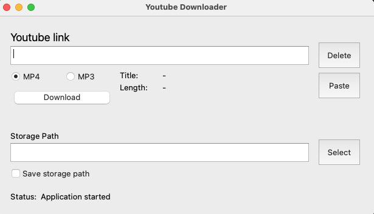

# What is this?

It is a program that will allow you to download videos on Youtube with only audio or video and audio without ads. It has
a simple interface and its interface is designed with qt.

## Installation

Use the package manager [pip](https://pip.pypa.io/en/stable/) to install requirement files or you can install all files
directly via requirements.txt

```bash
pip install pytube
pip install pyqt5
```

## Usage

Install the required packages, download the repository and run it :)



## License

[MIT](https://choosealicense.com/licenses/mit/)